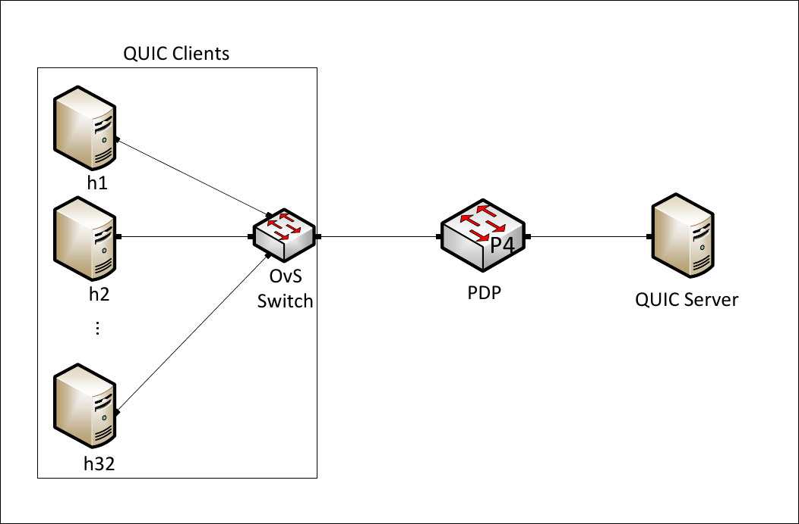
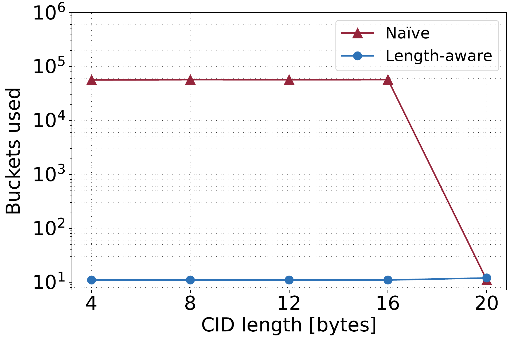
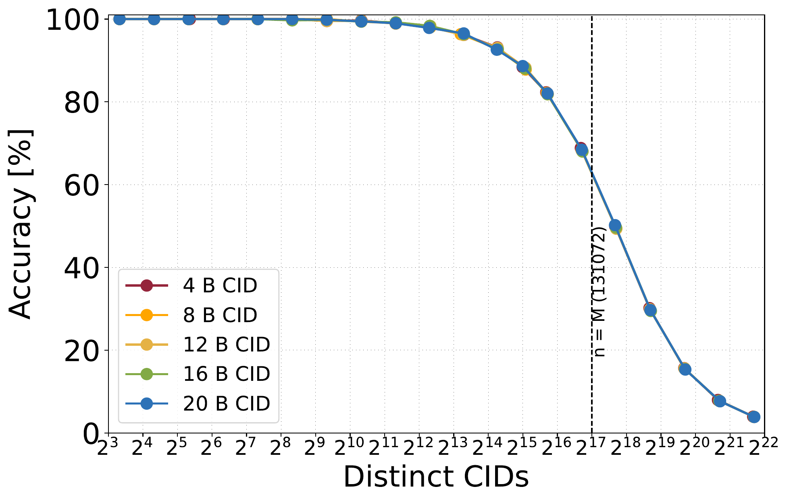
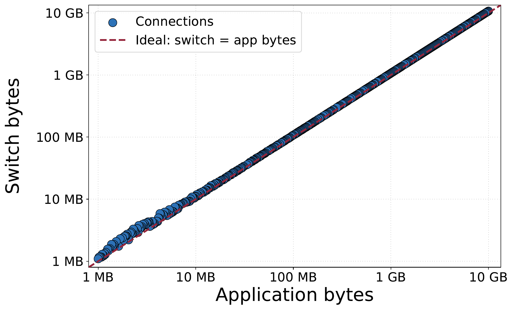
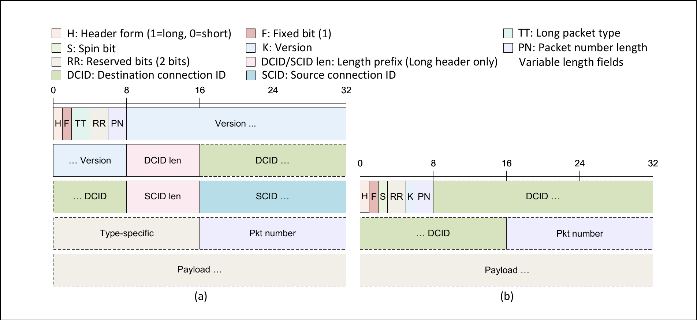
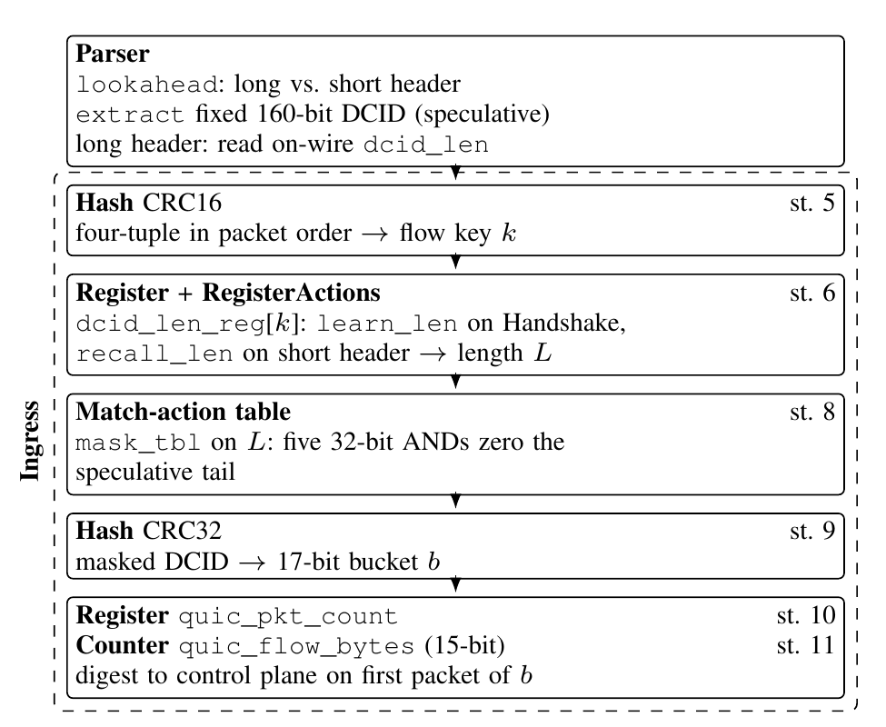

# P4-QUIC: Length-Aware, In-Network QUIC Connection Monitoring on a Tofino Switch

This repository is the artifact for an IEEE Networking Letters paper. It
implements per-connection QUIC traffic monitoring entirely in the data plane of
an Intel Tofino 1 switch (Edgecore 100BF-32X). The switch parses QUIC Long and
Short headers, extracts the Destination Connection ID (DCID), learns each
connection's DCID **length** from the handshake, masks the DCID to that length,
hashes it with CRC32 into a 17-bit (131,072-entry) bucket, and counts packets
and bytes per connection using stateful registers and counters. All of this runs
at line rate without decrypting QUIC or terminating the session. The key result
is that *length-aware* bucketing collapses the bucket blow-up caused by treating
every DCID as a fixed 20 bytes (≈57,000 spurious buckets) down to one bucket per
connection direction (≈11), restoring accurate per-connection accounting.

---

## Testbed Topology

[](figures/not-in-paper/topo.pdf)

The diagram above is the logical topology used for the experiments (data and
management networks). It is embedded as a PNG for inline rendering; click it, or
open [`figures/not-in-paper/topo.pdf`](figures/not-in-paper/topo.pdf), for the
vector version. It was removed from the paper for space (see [Figures](#figures)).

QUIC runs over UDP destination port 443 in both directions. PC1 attaches to
front-panel port 2 (dev port 136) and PC2 to front-panel port 1 (dev port 128),
both on pipe 1. The switch forwards 136↔128 transparently and, for UDP/443
packets, performs the QUIC-aware classification described above.

---

## Repository Layout

| Path | Description |
|------|-------------|
| `p4src/` | P4_16 / TNA data plane (parser, ingress classification, deparser, egress, checksum) |
| `bfrt_python/` | BF-RT control-plane scripts (forwarding setup, A/B arm toggle, counter reset, register/counter dumps, live monitors) |
| `quic_perf_client.py`, `quic_perf_server.py` | Python (`aioquic`) QUIC throughput client/server. **Tooling used to generate the workload for the paper's results.** |
| `go_perf/` | Go (`quic-go`) QUIC throughput client/server source, built with `make`. Alternative harness; not used for the reported measurements. |
| `plots/` | Matplotlib figure generators (`plot_*.py`) for the paper |
| `analyze_pcap.py`, `pcap_buckets.py`, `endpoint_buckets.py`, `analyze_bytes.py` | Offline analysis: derive ground-truth buckets/bytes from a capture and diff them against the switch |
| `topo_pc1.py` | Builds 32 sender network namespaces on PC1 to push the flow count toward 2^20 |
| `create_topology_organized.ipynb` | Notebook documenting the multi-namespace sender topology |
| `run_sweep.sh` | Experiment 2 driver: flow-count (L) accuracy sweep at a fixed transfer size |
| `run_overload.sh` | Experiment 2 driver: oversubscribe the 2^17-bucket classifier up to 2^20 connections |
| `run_cidlen_sweep.sh` | Experiment 1 driver: repeat the overload sweep for CID lengths 4, 8, 12, 16, 20 |
| `run_bytes_sweep.sh`, `run_bytes_manyflows.sh` | Experiment 3 drivers: per-connection byte-count parity (switch vs application) |
| `deploy.sh` | `scp` source + control plane + perf tools to the switch and to PC2 |
| `config_env.sh` | Sources the Tofino SDE environment (`$SDE`, etc.) |
| `*_flows/`, `*_overload/`, `bytes_sweep/` | Aggregated result CSVs that drive the figures (per-run dumps are not committed) |
| `figures/` | Paper figures, plus `figures/not-in-paper/` for figures cut for space (see [figures/README.md](figures/README.md)) |
| `logs/` | `mau.resources.log`: bf-p4c 9.6.0 compile resource report behind the paper's resource table and pipeline diagram |

---

## Prerequisites

**Switch (Tofino):**
- Intel `bf-sde-9.6.0` with the `bf-p4c` 9.6.0 compiler (P4_16 / TNA).

**Client / server hosts (PC1, PC2):**
- Python 3 with `aioquic` (`pip install aioquic`) for the aioquic perf tools.
  These generated the workload for the paper's results.
- Go 1.21+ to build the Go perf tools (`go_perf/`), an alternative harness not
  used for the reported measurements.
- `tcpdump` for the capture-based accuracy experiments.
- `python3` with `matplotlib` and `numpy` to regenerate figures.
- `sudo` access for `tcpdump` and for the network namespaces used by the
  overload / CID-length experiments (`topo_pc1.py`).

**TLS test certificate.** The perf tools need a self-signed certificate, which is
**not** committed. Generate one (clients skip verification):

```bash
openssl req -x509 -newkey rsa:2048 -keyout quic_key.pem \
    -out quic_cert.pem -days 365 -nodes -subj "/CN=localhost"
```

---

## Build

### P4 program (on the switch)

```bash
source config_env.sh          # sets $SDE and SDE env vars
~/tools/p4_build.sh --with-p4c=bf-p4c p4src/basic.p4
```

### Perf tools (on PC1 / PC2)

The aioquic tools (`quic_perf_client.py`, `quic_perf_server.py`) generated the
paper's workload and need no build; run them with `python3` (see Prerequisites
for `aioquic`).

The Go tools are an alternative harness. Build them with:

```bash
cd go_perf
make            # produces ../quic_perf_go_client and ../quic_perf_go_server
```

Both Go binaries default to 20-byte connection IDs to match the P4 parser, which
speculatively reads 20 DCID bytes for every QUIC packet.

---

## Run the Switch

```bash
# Terminal 1 — switch daemon:
cd $SDE && ./run_switchd.sh -p basic

# Terminal 2 — install forwarding rules + select the default (length-aware) arm:
$SDE/run_bfshell.sh --no-status-srv -b ~/P4-QUIC/bfrt_python/setup.py
```

### Control-plane workflow

All scripts below run via `run_bfshell.sh --no-status-srv -b <script>` (batch),
or, for the live monitors, via `bfrt_python <script>` inside an interactive
`bfshell`.

| Task | Script |
|------|--------|
| Forwarding rules + default arm | `bfrt_python/setup.py` |
| **A/B: length-aware arm** (`force_len = 0`) | `bfrt_python/set_aware.py` |
| **A/B: naive 20-byte arm** (`force_len = 20`) | `bfrt_python/set_naive.py` |
| Clear registers/counters before a run | `bfrt_python/reset_counts.py` |
| Dump per-bucket packet register → `switch_buckets.csv` | `bfrt_python/dump_buckets.py` |
| Dump per-bucket byte counter → `switch_bytes.csv` | `bfrt_python/dump_bytes.py` |
| Live per-connection monitor (digest + register) | `bfrt_python/quic_monitor.py` |
| Live register-only poller | `bfrt_python/poll_quic.py` |

The **A/B toggle** is the heart of the length-aware result: `cfg_tbl`'s default
action sets `force_len`. With `force_len = 0` (length-aware) the switch masks
each DCID to the length it learned from the handshake before hashing; with
`force_len = 20` (naive) it hashes the full speculative 20 bytes, so CID
rotation and sub-20-byte CIDs scatter a single connection across thousands of
buckets. Switching arms takes effect on the next packet with no recompile.

### Generate QUIC traffic

The aioquic tools below generated the paper's workload. The `--cid-length` flag
sets aioquic's `connection_id_length`, which is how the DCID length was varied.

```bash
# On PC2 (server):
python3 quic_perf_server.py --port 443 --cid-length 20

# On PC1 (client):
python3 quic_perf_client.py 192.168.0.2 -P 100 -n 10000000 --cid-length 20   # 100 flows, 10 MB each
```

aioquic client flags: `-P` parallel flows, `-n` bytes/flow, `--cid-length`,
`-t` duration, `-i` reporting interval.

The Go tools are an equivalent alternative harness (not used for the reported
measurements) and take single-dash flags:

```bash
# On PC2 (server):
./quic_perf_go_server -p 443 -cid-length 20

# On PC1 (client):
./quic_perf_go_client -P 100 -n 10000000 -cid-length 20 192.168.0.2   # 100 flows, 10 MB each
```

Additional Go client flags: `-nmin`/`-nmax` (log-uniform skewed sizes),
`-single-cid` (pin all CIDs to one bucket), `-download` (server→client bulk),
`-t` duration, `-i` interval.

---

## Experiments

Each experiment has a driver script that runs the traffic and writes an
aggregated result CSV, plus a plot script that turns that CSV into the paper
figures. The aggregated CSVs are committed, so **all figures can be regenerated
without switch hardware**:

```bash
pip install matplotlib numpy
cd plots && python3 plot_<name>.py
```

> **Note on tooling.** The `run_*.sh` drivers below wrap the Go perf tools, the
> alternative harness. The workload for the paper's reported results was
> generated with the aioquic tools (see
> [Generate QUIC traffic](#generate-quic-traffic)). Experiment 3 in particular
> relies on Go-only client flags (`-single-cid`, `-download`).

### Experiment 1 — Length-aware classification

The headline comparison of buckets consumed by the naive vs length-aware arm
across CID lengths. The monitor holds each connection to about 11 buckets for
4–16 byte CIDs (12 for 20-byte), independent of the ~75,000 packets carried,
while the naive 20-byte parser scatters one short-CID connection across ~57,000
buckets.



> This comparison figure was cut from the paper for space (see
> [Figures](#figures)); the measurement is valid.

```bash
# Driver (needs hardware): sweeps CID lengths 4,8,12,16,20, each into cid<NN>_overload/
./run_cidlen_sweep.sh
```

Figures:
- `plots/plot_buckets.py` → `buckets_vs_cidlen.pdf` (Naïve ≈57k vs length-aware ≈11)
- `plots/plot_cidlen.py` → `cidlen_buckets.pdf`, `cidlen_accuracy.pdf`
  (from `cid*_overload/overload_results.csv`)

### Experiment 2 — Accuracy under load

How classification accuracy holds up as the connection count approaches and
exceeds the 131,072-bucket register. Accuracy is governed by n/M rather than CID
length: above 96% near 10^4 distinct CIDs and above 80% near 5×10^4, degrading
as the table saturates past n = M.



```bash
# Drivers (need hardware):
BYTES=1000000  OUTDIR="$PWD/1MB_flows"  ./run_sweep.sh    # 1 MB/flow sweep
BYTES=10000000 OUTDIR="$PWD/10MB_flows" ./run_sweep.sh    # 10 MB/flow sweep
./run_overload.sh                                         # push L toward 2^20
```

Figures:
- `plots/plot_accuracy.py` → `accuracy_vs_flows.pdf`, `buckets_vs_flows.pdf`
  (from `1MB_flows/`, `10MB_flows/`, `2pow20_overload/`)
- `plots/plot_overload.py` → `overload_accuracy.pdf`, `overload_buckets.pdf`
  (from `2pow20_overload/overload_results.csv`)

### Experiment 3 — Per-connection volume accounting

The hardware byte counter (`quic_flow_bytes`) vs the application's ground-truth
byte count, per connection, for 500 concurrent transfers spanning 1 MB to 10 GB.
Switch counts track the ideal line across four decades, running modestly above
the application bytes because the counter includes Ethernet, IP, UDP, QUIC and
control overhead.



```bash
# Drivers (need hardware):
./run_bytes_sweep.sh                 # one flow per size, 1 MB .. 100 MB
P=500 ./run_bytes_manyflows.sh       # many concurrent flows at scale
```

Figures:
- `plots/plot_bytes_scatter.py` → `bytes_scatter.pdf` (from `bytes_sweep/bytes_results.csv`)
- `plots/plot_bytes.py` → `bytes_parity.pdf`, `bytes_per_bucket.pdf`,
  `bytes_relerr.pdf`, `bytes_signal_control.pdf` (from `byte_diff.csv`, `switch_bytes.csv`)

---

## How It Works (data plane)

QUIC exposes its Long and Short header forms in cleartext. The parser reads the
first byte to tell them apart and, for Long (handshake) headers, the on-wire
DCID length prefix:



The block diagram below maps the design onto the Tofino data-plane structures,
annotated with the compiled stage of each object (matching
[`logs/mau.resources.log`](logs/mau.resources.log)):



1. The parser walks Ethernet → IPv4 → UDP. For UDP/443 it peeks at the first
   byte: bit 7 = 1 selects the QUIC Long header (DCID length is on the wire);
   bit 7 = 0 selects the Short header. Either way it speculatively reads 20 DCID
   bytes.
2. From Long-header (handshake) packets the switch learns the connection's true
   DCID length into `dcid_len_reg`.
3. The learned length (or `force_len`, per the A/B arm) drives a mask that zeroes
   the unused DCID bytes, so only the meaningful bytes feed the hash.
4. A single `Hash<bit<17>>(CRC32)` over the masked DCID yields the bucket index
   (one CRC call before any conditional, per a bf-p4c 9.6.0 constraint).
5. `quic_flow_bytes` (a `PACKETS_AND_BYTES` counter) accumulates per-bucket
   packets and bytes for both directions; `quic_pkt_count` (a register)
   increments for server→client packets. The first packet of a new bucket emits
   a digest to the control plane.

### Length-recovery algorithm

The learned length selects a 160-bit mask that keeps the true DCID bytes and
zeroes the speculative tail before CRC32 hashing (Algorithm 1 in the paper):

```text
Require: speculative 20-byte DCID D; flow key k; length register R;
         mask table M, where M[L] keeps the first L bytes
Ensure:  flow bucket b
 1: if p is a long-header packet then
 2:     L <- on-wire DCID length
 3:     if p is a Handshake packet then
 4:         R[k] <- L
 5:     end if
 6: else if p is a short-header packet then
 7:     L <- R[k]              # 0 if not yet learned
 8: end if
 9: b <- CRC32(D & M[L]) mod 2^17
```

### Compiled resource report

The paper's resource table and the per-stage figures in the pipeline diagram are
taken from the bf-p4c 9.6.0 compile log, committed at
[`logs/mau.resources.log`](logs/mau.resources.log). It lists per-stage and total
MAU usage across the 12 stages (totals: 74 SRAM, 71 Map RAM, 101 hash bits,
0 TCAM), so a reader can verify the reported SRAM, Map RAM, hash-bit, TCAM and
per-stage numbers without recompiling.

Table I from the paper (compiled resource use on Tofino 1):

| Resource | Total | Peak stage use |
|----------|-------|----------------|
| Ingress MAU stages | 12 | – |
| SRAM blocks | 74 | 41.25% |
| Map RAM units | 71 | 68.75% |
| TCAM blocks | 0 | 0% |
| Hash bits / dist. units | 101 / 6 | 4.09% / 33.33% |
| Meter / stats ALUs | 2 / 1 | 25% / 25% |

The dominant cost is per-bucket state in stages 10 and 11 (the packet-count
register and byte counter); length learning itself uses five RAM and five Map
RAM units in stage 6.

### Known bf-p4c 9.6.0 constraints (relevant for reproducibility)

| Issue | Workaround in this code |
|-------|-------------------------|
| `Hash.get({field})` struct literal rejected | Pass the field directly: `Hash.get(meta.dcid)` |
| Multiple `Hash.get()` calls per instance rejected | Single unconditional `get()` before any conditional |
| Parser `select` with `_` wildcard unreliable at runtime | Chained single-key parser states |
| BF-RT Python dict keys are byte strings | Use `b"$REGISTER_INDEX"`, not `"$REGISTER_INDEX"` |
| Register/counter data is a per-pipe list | Sum across pipes: `sum(raw)` |

---

## Figures

Paper figures live in [`figures/`](figures/). Figures cut from the manuscript
only for the four-page Letter limit live in
[`figures/not-in-paper/`](figures/not-in-paper/); their measurements are valid.
Result plots are committed as vector PDFs with PNG copies for inline display in
this README. The data-plane pipeline diagram (`pipeline.png`) is a raster export
of the figure drawn inline in the manuscript LaTeX. See
[`figures/README.md`](figures/README.md) for a per-file description. Regenerate
the plots from the committed CSVs with `plots/*.py`.

## License

Released under the MIT License. See [LICENSE](LICENSE).
